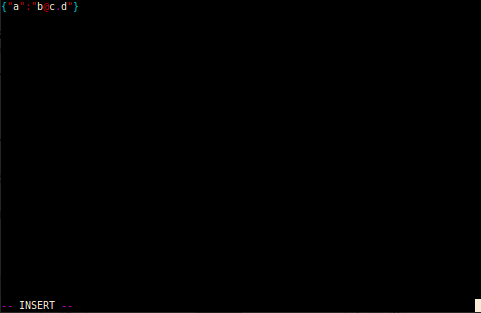

# ReadMe

## (1) Contents

  * (1) Contents
  * (2) Introduction
  * (3) Use
  * (4) Environment
  * (5) Build
  * (6) About

## (2) Introduction

This code is a simple file editor for text files built in the same spirit as
`Vim`, with much the same commands where possible.

The following are the main goals of the program:

  * Small binary size (< 20kB)
  * Simple use (lower number of commands)
  * Automatic colouring
  * Fast
  * Low RAM usage (even for large files)

## (3) Use

Below is some examples of the system in use:

## (4) Environment

To install the required packages, please run the following (Debian):

    sudo apt-get install cmake cppcheck gcc git libncurses5-dev pandoc

  * `cmake`           - Allows for easy building of the system.
  * `cppcheck`        - Static code analysis for C/C++.
  * `gcc`             - Allows compilation of the source code.
  * `git`             - Access to the repository.
  * `libncurses5-dev` - Library for the UI of the text editor.
  * `pandoc`          - Allows compilation of the documentation.

If you require more libraries or this documentation is out of date for any
reason, please raise a ticket on GitHub.

## (5) Build

### Code

Initially, you'll need to run the following command once:

    cmake .

After this, only the following command should be required:

    make

### Documentation

To build the documentation, please run the following commands depending on the
output you require:

#### PDF

    pandoc readme.md -s -o readme.pdf

#### HTML

    pandoc readme.md -s -o readme.html

## (6) About

Written by B[].
